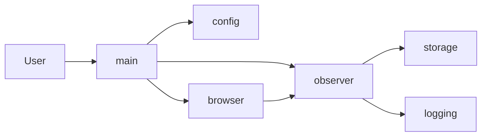

# Architecture

## Project purpose

Product Observer is a **browser instrumentation toolkit** for observing and reverse-engineering web applications. When backend access is restricted or APIs are undocumented, the UI is often the only reliable interface. The tool analyzes a system **from the outside** by reusing an authenticated browser session and recording how the application behaves.

The core is **domain-agnostic**: it works for any web-based system (e.g. internal dashboards, ERP, ecommerce). An initial use case may be a warehouse-style application, but the architecture does not depend on any single domain. Domain-specific logic belongs in a future **domain layer**, not in the core engine.

---

## Architectural principles

- **Domain-agnostic core** — Browser, network observer, storage, models, configuration, and logging contain no assumptions about a specific business domain.
- **Domain layer for specializations** — Domain-specific logic (endpoint patterns, entity extractors, workflow rules) may exist later under a `domains/` layer (e.g. wms, ecommerce, erp). The core does not depend on it.
- **Phase-based evolution** — The system evolves in phases to avoid premature complexity. Each phase adds capability without over-engineering earlier phases. See [phases.md](phases.md).
- **Read-only, passive observation** — The toolkit never modifies requests, injects traffic, or replays API calls. It only observes and records.

---

## High-level system components

### Core engine

| Component | Responsibility |
|-----------|-----------------|
| **browser** | Launch and manage Playwright browser (persistent context), navigate to target URL. |
| **network observer** | Attach to browser context, filter API-like traffic, capture request/response data, delegate to storage and logging. |
| **storage** | Persist captured network events and response bodies (e.g. JSON files, optional gzip). |
| **models** | Data structures for network events (method, URL, status, timing, size, etc.). |
| **configuration** | Load settings from environment (target URL, paths, limits, filters). |
| **logging** | Structured console output for captured events and warnings. |

### Future domain layer

A **domain layer** under `domains/` is planned but **not implemented yet**. It will hold:

- **domains/wms** — Warehouse-style applications (example domain).
- **domains/ecommerce** — E-commerce and catalog systems.
- **domains/erp** — ERP and business-process systems.

These modules may later provide endpoint patterns, entity extractors, workflow rules, and documentation templates. The core engine remains independent of them. Currently only the folder structure and placeholders exist.

---

## Repository structure

```
product-observer/
├── main.py                 # Entry point; loads config, starts browser, attaches observer
├── product_observer/       # Core package (domain-agnostic)
│   ├── config.py          # Settings and env loading
│   ├── logging_config.py  # Console logging setup
│   ├── utils/             # Helpers (e.g. human-like delays)
│   ├── models/            # Network event models
│   ├── storage/           # File storage for captured data
│   ├── browser/           # Playwright browser controller
│   ├── network/           # Network observer
│   └── domains/           # Placeholder only (wms, ecommerce, erp)
├── data/raw_requests/     # Default output for captured requests
├── browser_profile/       # Persistent browser profile
└── docs/                  # Project documentation
```

The domain layer under `product_observer/domains/` is structure-only in Phase 1; no domain logic is implemented.

---

## Data flow (Phase 1)

1. User runs `main.py`.
2. Configuration is loaded from environment (e.g. target URL, output dir).
3. Browser starts with a persistent context and navigates to the target URL (with optional human-like delay).
4. Network observer attaches to the browser context and listens for request/response events.
5. User logs in and interacts with the application in the browser.
6. Observer filters events (e.g. by resource type and URL), captures request/response data, and passes it to storage.
7. Storage writes raw network data to disk (e.g. JSON per request); observer logs summaries to the console.
8. User stops the process (e.g. Ctrl+C); browser and observer shut down cleanly.



---

## Future domain extension layer

The `domains/` directory is reserved for future domain-specific extensions. Each domain (wms, ecommerce, erp) may eventually provide:

- Endpoint patterns and filters
- Entity extractors from response payloads
- Workflow rules and sequencing
- Documentation templates

The core engine will remain unchanged; domain modules will be optional consumers or annotators of the raw data produced in Phase 1. No domain logic is implemented in the current phase.

---

## Evolution through phases

The system is designed to evolve through defined phases (see [phases.md](phases.md)): Network Observation → API Intelligence → Domain Discovery → Knowledge & Documentation Generation. Each phase builds on the previous without rewriting the core; the domain layer will align with Phase 3 and beyond.
