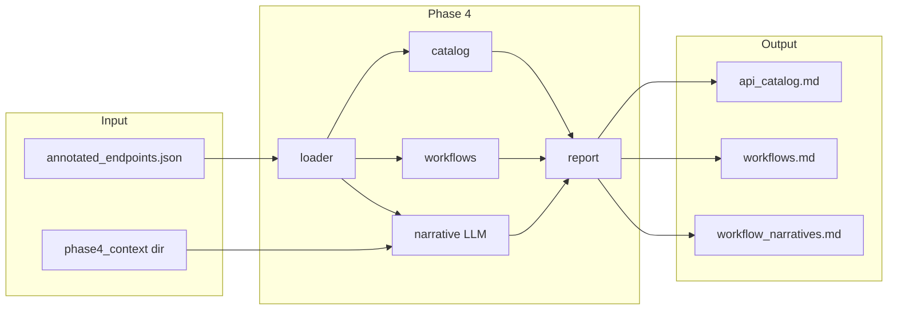

# Phase 4 — Knowledge & Documentation Implementation Plan

## Context

- **Input**: `data/phase3/annotated_endpoints.json` (endpoints with `method`, `normalized_path`, `request_count`, `example_urls`, `response_schema`, `annotations`).
- **Annotations** used: `category` (auth/config/business), `domain_hint`, `workflow_hint`, `entities`.
- **Existing pattern**: Phase 2 and Phase 3 use a thin CLI in `run.py`, a `loader.py`, and a `report.py` (or equivalent) that writes to an output dir. Phase 2 builds Markdown via list-of-strings in `product_observer/phase2/report.py`.



---

## 1. Define Phase 4 scope and outputs

**Scope (to implement):**

- **Input**: Single file path to Phase 3 output (default: `data/phase3/annotated_endpoints.json`).
- **Context for LLM**: Optional directory (default: `docs/phase4_context/`). All `.md` and `.txt` files under that directory are read and concatenated into one context string (with optional file/section labels) and passed to the LLM when generating the narrative. Overridable via env `PHASE4_CONTEXT_DIR`. If the directory is missing or empty, the narrative step still runs with only the structured data.
- **Outputs** (all under configurable output dir, default: `data/phase4/`):
  - **API catalog** (`api_catalog.md`): Markdown document with sections by **category** (Auth, Config, Business). Each section lists endpoints with: method, path, request count, optional entities/workflow_hint, and a compact “returns” summary (e.g. top-level keys of `response_schema` or “object”).
  - **Workflow view** (`workflows.md`): Group endpoints by **workflow_hint** (e.g. “inbound”). For each workflow, list endpoints (method, path, category, entities). Endpoints without `workflow_hint` go in an “Other” section.
  - **Workflow narratives** (`workflow_narratives.md`): LLM-generated “map” of discoveries—prose describing each workflow and how endpoints fit together. Generated by calling Anthropic API with structured data (catalog + workflow groupings) plus the optional context string from the context directory. Requires `ANTHROPIC_API_KEY` unless `--no-llm` is set.

**Out of scope for this plan:** Query normalization in Phase 2/3, cross-referencing `api_surface.md` (can be a follow-up).

---

## 2. Design the Phase 4 pipeline

**New package**: `product_observer/phase4/`

| File | Responsibility |
|------|-----------------|
| `loader.py` | Load `annotated_endpoints.json` (array of endpoint dicts); validate presence of `annotations` (or treat missing as `{}`). |
| `catalog.py` | Build **API catalog** structure: group endpoints by `annotations.get("category", "other")`, sort categories (e.g. auth, config, business, other), then by method+path. Produce a simple dataclass or list-of-dicts for “sections + rows”. |
| `workflows.py` | Build **workflow** structure: group by `annotations.get("workflow_hint")`. Produce list of (workflow_name, list of endpoint summaries). |
| `report.py` | Emit Markdown: from catalog structure → `api_catalog.md`; from workflow structure → `workflows.md`. Use the same style as Phase 2 (list of lines, `Path.write_text`). Also write `workflow_narratives.md` when provided (string from narrative step). |
| `narrative.py` | Load context from optional directory (`docs/phase4_context/` or `PHASE4_CONTEXT_DIR`): read all `.md`/`.txt` files, concatenate with labels. Build prompt (structured data + context string), call Anthropic API with `ANTHROPIC_API_KEY`, return generated markdown. If `--no-llm` or no key, skip and return None. |
| `run.py` | CLI: `--input` (default `data/phase3/annotated_endpoints.json`), `--output` (default `data/phase4`), `--no-llm` (skip narrative generation), `-v/--verbose`. Call loader → catalog + workflows → report (write api_catalog.md, workflows.md); then if not --no-llm and key set, call narrative → write workflow_narratives.md. |
| `__main__.py` | Delegate to `run.main()` so `python -m product_observer.phase4` works. |
| `__init__.py` | Minimal (expose `main` or leave empty). |

**Dependencies:** Add `anthropic` to `requirements.txt`. Document `ANTHROPIC_API_KEY` (required only for narrative generation) and the context directory in README and phases.md.

**CLI surface:**

```bash
python -m product_observer.phase4 [--input PATH] [--output DIR] [--no-llm] [-v]
```

---

## 3. Use Phase 3 annotations explicitly

- **category** → Sections in `api_catalog.md`: “## Auth”, “## Config”, “## Business”, “## Other”. Order fixed for stability.
- **workflow_hint** → Sections in `workflows.md`: “## Inbound”, “## Other”. Show method, path, category, entities per endpoint.
- **entities** → In both reports: show as comma-separated or “Entities: A, B”.
- **response_schema** → In API catalog: short summary line (e.g. top-level keys) to keep the doc readable.
- **Structured data + context** → Passed to the LLM for `workflow_narratives.md`: catalog and workflow groupings plus the concatenated context string from the context directory so the model can use project-specific notes, glossary, or domain overview.

**Edge cases:** Missing `annotations` → treat as `{}`; missing `category` → “other”; missing `workflow_hint` → “Other” workflow section. Missing or empty context dir → narrative runs with structured data only.

---

## 4. Optional enhancements (deferred)

- **Query normalization**: Not in this implementation. Phase 2/3 could later normalize or strip common query params; Phase 4 would consume improved Phase 3 output without change.
- **Cross-reference**: Add a line in Phase 4 markdown: “For full response schemas see Phase 2 `api_surface.md`.” Low cost, can be included in the initial report text.
- **HTML / per-domain templates**: Leave for a later iteration.

---

## 5. Agent context and docs

- **docs/phases.md**: Update Phase 4 section from “Planned” to “Implemented” (once done) and add a “Phase 4 implementation” subsection: command `python -m product_observer.phase4`, default input/output, generated files (`api_catalog.md`, `workflows.md`, `workflow_narratives.md`), optional context directory `docs/phase4_context/` and env `PHASE4_CONTEXT_DIR`, and `ANTHROPIC_API_KEY` for narrative generation; `--no-llm` to skip it.
- **README.md**: Add Phase 4 run instructions and document `ANTHROPIC_API_KEY` and context directory in the configuration table or a short “Phase 4” section.
- **docs/agent-context.md**: When implementing, refresh **Current State**, **Current Task**, **Next Steps**. User can run “update agent context” after implementation.

---

## Implementation order

1. Add `product_observer/phase4/` package: `__init__.py`, `loader.py`, `catalog.py`, `workflows.py`, `report.py`, `narrative.py`, `run.py`, `__main__.py`.
2. Implement loader (read JSON, return list of endpoint dicts; handle missing annotations).
3. Implement catalog grouping (by category) and workflow grouping (by workflow_hint).
4. Implement report: build Markdown for API catalog and workflows; write both to output dir.
5. Implement narrative: load context from `docs/phase4_context/` (or `PHASE4_CONTEXT_DIR`), build prompt from structured data + context, call Anthropic, return markdown string; support `--no-llm` and missing `ANTHROPIC_API_KEY`.
6. Wire CLI in run.py and __main__.py: after writing api_catalog.md and workflows.md, call narrative and write workflow_narratives.md when not --no-llm and key is set.
7. Add `anthropic` to requirements.txt. Update docs/phases.md and README with Phase 4 command, outputs, context directory, and ANTHROPIC_API_KEY.
8. Add `data/phase4/` to .gitignore if desired; optionally add `docs/phase4_context/.gitkeep` so the context directory exists in repo.

No changes to Phase 2 or Phase 3 code; Phase 4 is additive and read-only on Phase 3 output.
